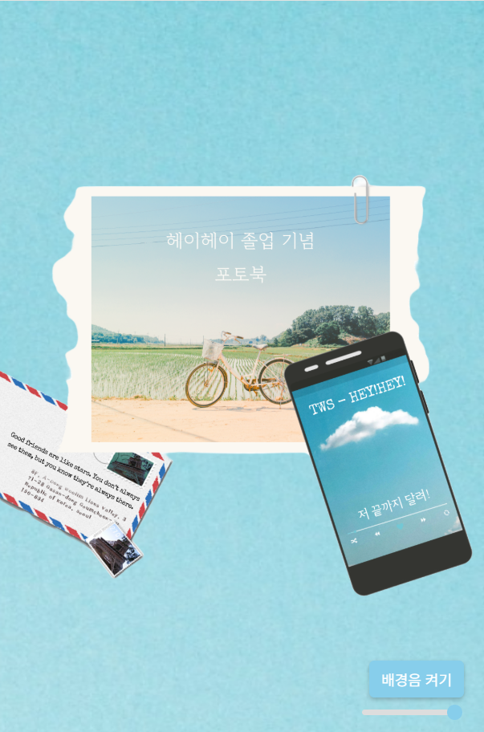
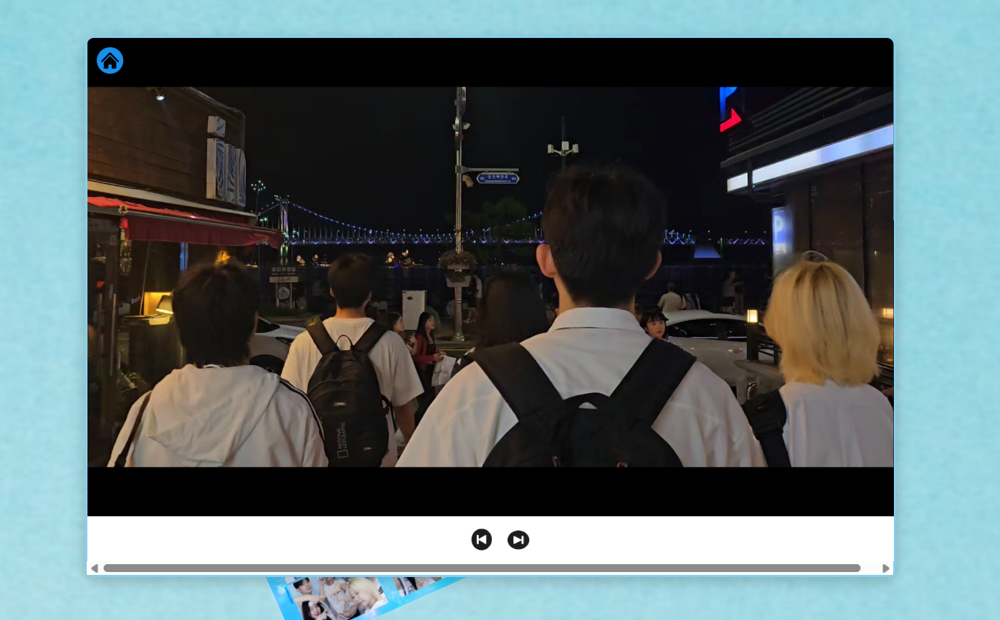
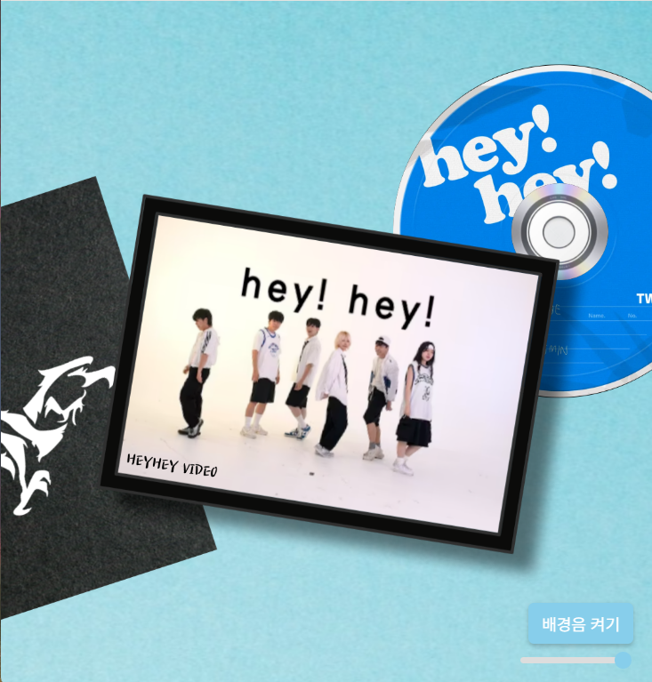
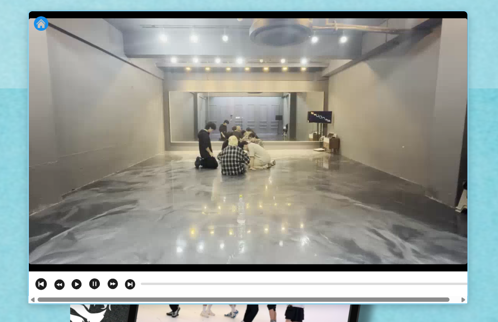

# 📸 Web Photobook Project (졸업 기념 디지털 포토북)



> **"소중한 추억을 디지털 공간에 담다."**
>
> *처음으로 제작해본 HTML, CSS, Vanilla JS로 구현한 인터랙티브 웹 포토북 프로젝트입니다.* 동아리 동료의 졸업 기념 선물용으로 제작하였습니다.

---

## 📋 1. 프로젝트 개요 (Overview)

*   **프로젝트명:** Hey!Hey!졸업기념포토북
*   **유형:** 웹 기반 인터랙티브 디지털 앨범
*   **플랫폼:** 모바일(웹 호환성X)
*   **개발 인원:** 1인 개발
*   **개발 기간:** 2025.02.17 ~ 2025.02.19
*   **주요 특징:**
    *   별도의 프레임워크 없이 **순수 JavaScript(Vanilla JS)**로 동적 기능 구현.
    *   사용자 경험(UX)을 고려한 **커스텀 비디오 컨트롤러** 제작.
    *   배경음악(BGM) 제어 및 볼륨 조절 기능 탑재.
    *   반응형 웹 디자인(Responsive Web Design) 적용.
    *   **Netlify** 오픈소스를 사용하여 배포.
---

## 📱 2. 미리보기 (Preview)

| 사진첩 페이지 | 사진첩 뷰어 (Photo Gallery) |
| :---: | :---: |
|  |  |

| 비디오 페이지 | 비디오 플레이어 (Video Player) | 
| :---: | :---: |
|  |  |

---

## 🛠️ 3. 기술 스택 (Tech Stack)

### Frontend
*   **HTML5**: 시맨틱 마크업 및 미디어 태그(`<audio>`, `<video>`) 활용.
*   **CSS3**: Flexbox 레이아웃, Media Query(반응형), CSS Animation.
*   **JavaScript (ES6+)**: DOM 조작, 이벤트 핸들링, 미디어 제어 로직.

### Assets & Tools
*   **Media**: 이미지, 비디오(MP4), 오디오(MP3) 리소스 관리.
*   **MiriCanvas&Photoshop**: 커스텀 버튼 아이콘 및 배경 이미지 디자인.
*   **Netlify**: 웹 호스팅

---

## 💡 4. 주요 기능 및 코드 (Features & Code)

### 4.1 스크롤 기반 섹션 네비게이션
*   사용자의 스크롤 위치를 감지하여 현재 보고 있는 섹션(`Section`)에 해당하는 버튼을 활성화(`active`)합니다.

<details>
<summary>💻 스크롤 감지 및 버튼 활성화 코드 (JavaScript)</summary>

```javascript
window.addEventListener('scroll', function() {
    const scrollPosition = window.scrollY;
    const windowHeight = window.innerHeight;
    const sections = document.querySelectorAll('.section');
    let newSection = 0;

    // 현재 뷰포트 중앙에 위치한 섹션 감지
    sections.forEach((section, index) => {
        const sectionTop = section.offsetTop;
        if (scrollPosition >= sectionTop - windowHeight / 2 && scrollPosition < sectionTop + windowHeight / 2) {
            newSection = index;
        }
    });

    if (newSection !== currentSection) {
        currentSection = newSection;
        updateButtons(); // 버튼 상태 업데이트 함수 호출
    }
});
```
</details>

### 4.2 커스텀 비디오 플레이어 (Custom Video Player)
*   브라우저 기본 컨트롤러 대신, 직관적인 UI(재생/일시정지, 10초 스킵, 프로그레스 바)를 직접 구현했습니다.
*   `timeupdate` 이벤트를 활용하여 프로그레스 바를 실시간으로 동기화합니다.

<details>
<summary>💻 비디오 컨트롤 및 프로그레스 바 로직 (JavaScript)</summary>

```javascript
// 비디오 진행률 업데이트
function updateVideoProgress() {
    const video = document.querySelector('.video-slide.active');
    const progressBar = document.getElementById('videoProgressBar');
    
    if (video && progressBar) {
        const update = () => {
            const percent = (video.currentTime / video.duration) * 100;
            progressBar.style.width = `${percent}%`;
        };
        video.addEventListener('timeupdate', update);
        update(); // 초기화 시 즉시 반영
    }
}

// 프로그레스 바 클릭 시 탐색 (Seeking)
function seekVideo(event) {
    const progress = document.querySelector('.video-progress');
    const video = document.querySelector('.video-slide.active');
    
    if (video && progress) {
        const rect = progress.getBoundingClientRect();
        const clickX = event.clientX - rect.left;
        const width = rect.width;
        const percent = clickX / width;
        video.currentTime = percent * video.duration;
        updateVideoProgress();
    }
}
```
</details>

### 4.3 배경음악 제어 (Audio Control)
*   자동 재생 정책(Auto-play Policy)을 고려하여 로드 시 재생을 시도하고, 실패 시 버튼을 통해 수동 제어할 수 있도록 구현했습니다.
*   볼륨 슬라이더(`input type="range"`)를 통해 실시간 볼륨 조절이 가능합니다.

<details>
<summary>💻 오디오 제어 로직 (JavaScript)</summary>

```javascript
// 볼륨 조절 및 음소거 해제 시 자동 재생
function adjustVolume(volume) {
    backgroundAudio.volume = volume;
    if (volume > 0 && !isPlaying) {
        backgroundAudio.play();
        isPlaying = true;
        document.getElementById('toggleAudio').textContent = '배경음 끄기';
    } else if (volume == 0 && isPlaying) {
        backgroundAudio.pause();
        isPlaying = false;
        document.getElementById('toggleAudio').textContent = '배경음 켜기';
    }
}
```
</details>

---

## 📂 5. 프로젝트 구조 (Directory Structure)

```
Web_Photobook/
├── index.html          # 메인 페이지 (HTML/CSS/JS 포함)
├── audio/              # 배경음악 파일 (background_music.mp3)
├── button/             # UI 컨트롤 버튼 이미지 (play, pause, next 등)
├── images/             # 배경 및 UI 디자인 리소스
├── pictures/           # 갤러리용 사진 파일 (picture_1.jpg ~ )
└── web/                # 갤러리용 비디오 파일 (video1.mp4 ~ )
```

---

## 🚀 6. 트러블 슈팅 (Troubleshooting)

### 이슈 1: 비디오 전환 시 이전 영상 재생 유지
*   **문제**: 다음 비디오로 넘어갔을 때, 이전 비디오가 멈추지 않고 소리가 겹쳐서 재생되는 현상.
*   **해결**: 비디오 전환 함수(`prevVideo`, `nextVideo`) 호출 시 `stopVideo()` 함수를 먼저 실행하여 현재 활성화된 비디오를 일시 정지하고 재생 시간을 0으로 초기화하도록 로직 수정.

### 이슈 2: 모바일 브라우저 자동 재생 제한
*   **문제**: 크롬 등 최신 브라우저 정책상 사용자 인터랙션 없이 오디오 자동 재생이 차단됨.
*   **해결**: `window.onload`에서 `play()`를 시도하되, `catch` 블록을 통해 실패 시 '배경음 켜기' 버튼을 노출하여 사용자가 직접 재생하도록 유도.

---

*Contact: (강원우/king_wonwoo@naver.com)*
